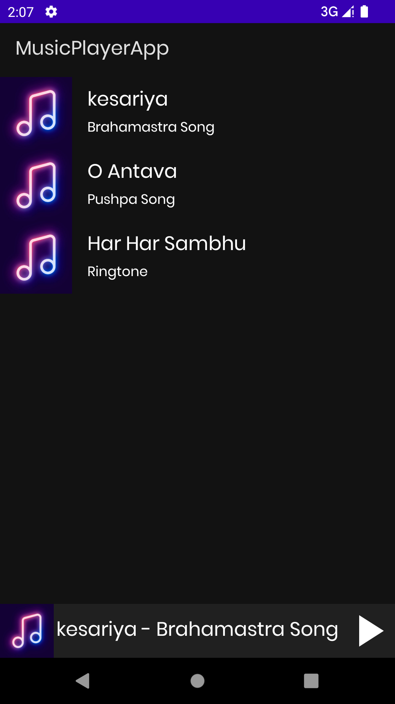
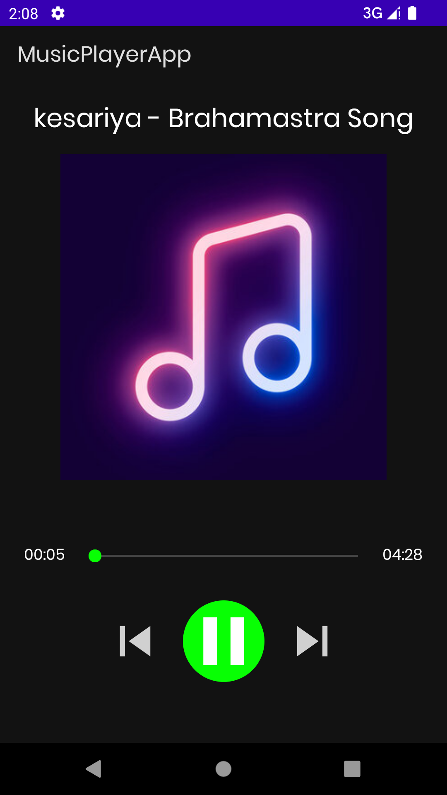
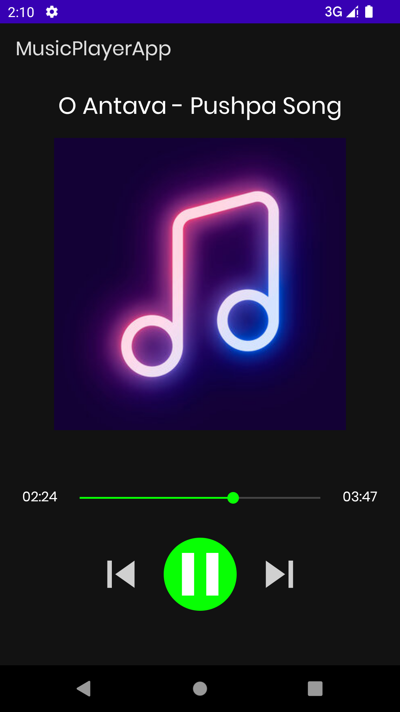

# MusicPlayerApp
This is a Music Player App where the songs list is fetched from Firebase Storage.
This App is desinged with MVVM Architecture pattern and Fragments has been used to design the UI.

